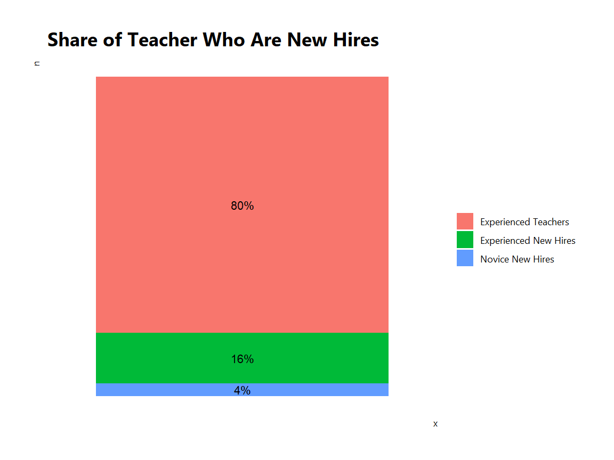
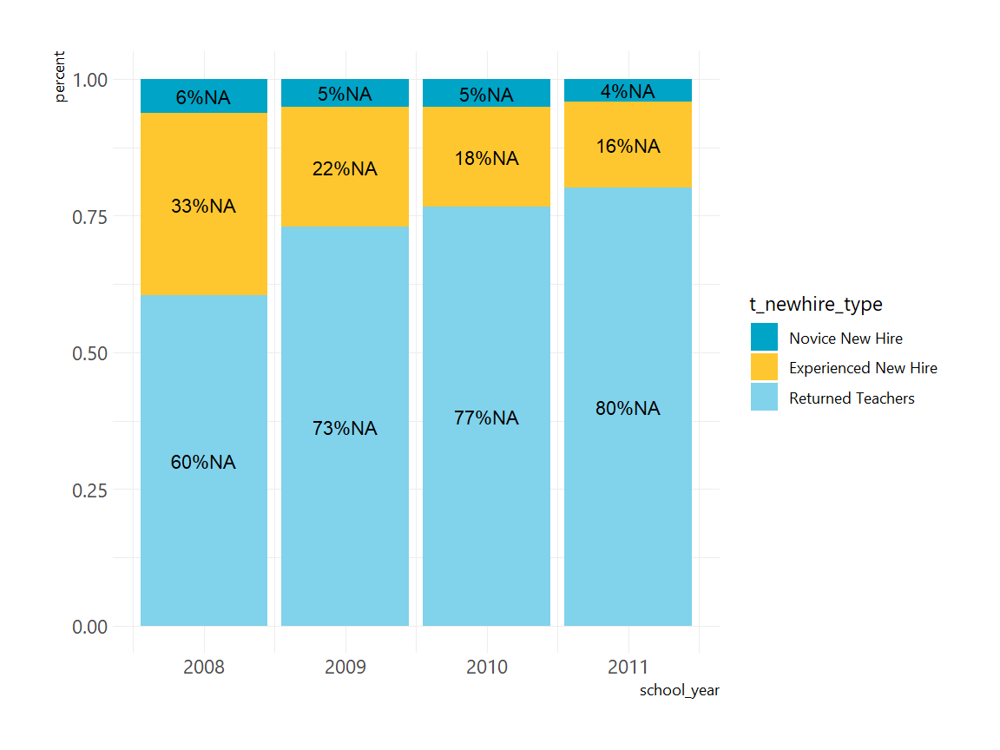
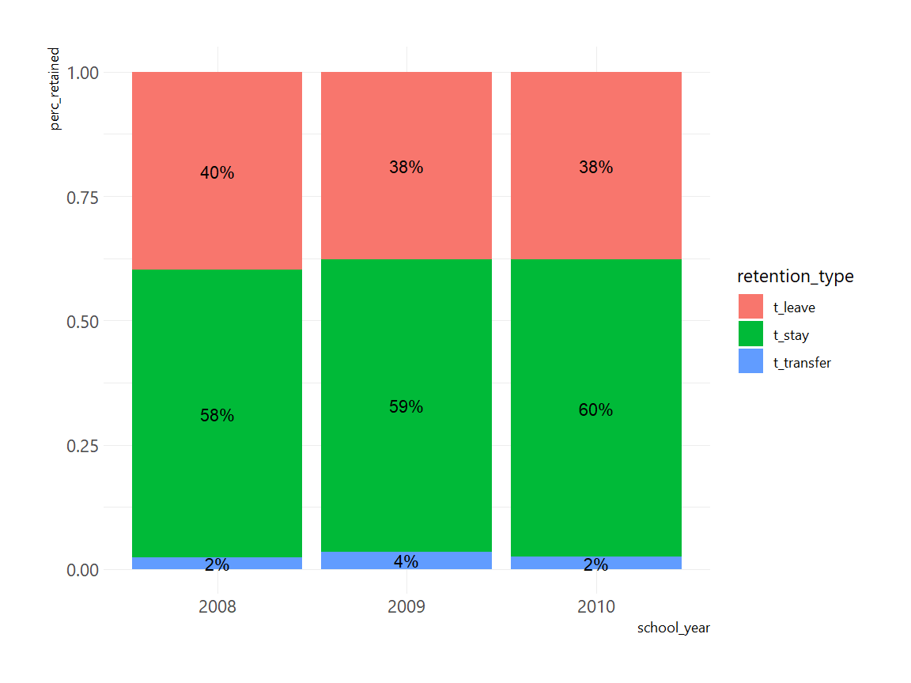

# Recruitment
*Caption*

*Programmed in R*

## Getting Started


<div class="navbar navbar-default navbar-fixed-top" id="logo">
<div class="container">

</div>
</div>

### Objective

In this guide, you will be able to...**explain objective here**

### Using this Guide

This guide utilizes data from...**explain origin of data here** 

Once you have identified analyses that you want to try to replicate or modify, click the 
"Download" buttons to download R code and sample data. You can make changes to the 
charts using the code and sample data, or modify the code to work with your own data. If 
you are familiar with Github, you can click "Go to Repository" and clone the entire repository to your own computer. 

Go to the Participate page to read about more ways to engage with the OpenSDP community or reach out for assistance in adapting this code for your specific context.

### About the Data

The data used in this guide...**explain origin of data, key features of data, and any other key information**. Create a small table of data features and description, like this:

| Feature name    | Feature Description                                 |
|:-----------     |:------------------                                  |
| `grade_level`   | Grade level of exam student took (3-8)              |
| `school_code`   | School ID number                                    |
| `sid`           | Student ID number                                   |
| `male`          | Student gender                                      |
| `race_ethnicity`| Student race/ethnicity                              |
| `eco_dis`       | Student level of economic disadvantage              |
| `lep`           | Level of Limited English Proficiency                |
| `iep`           | Indicator if student enrolled in special education  |
| `rdg_ss`        | Scale score for reading exam                        |
| `math_ss`       | Scale score for math exam                           |

#### Loading the OpenSDP Dataset and R Packages

This guide takes advantage of several key R packages. The first chunk of code below loads the R packages (make sure to install first!), and the second chunk loads the dataset.


```r
# // Step 1: Read in dat file of our dataset, naming it "texas.data"
student_teacher_year_analysis <- read_dta(here("data/Student_Teacher_Year_Analysis.dta"))
teacher_year_analysis <- read_dta(here("data/Teacher_Year_Analysis.dta"))
```

## Analyses

#### Calculate Average Annual Teacher Retention ----------------------------------------

**Purpose:** Examine basic novice teacher retention patterns for years in the agency.

**Required Analysis File Variables:**

- `tid` 
- `school_year`        
- `t_stay` 
- `t_transfer`      
- `t_leave`

**Analysis-specific sample restrictions**

- Keep only years for which next-year retention status can be calculated.

**Ask Yourself**

- Are transfer and attrition rates what you expected?
- What is the optimal balance for your agency between retaining experienced teachers and recruiting, hiring, and training new teachers?

**Potential further analyses**

You can add a category for retirees, if you have explicit retirement data, or for “likely retirees,” teachers who left teaching and were above a cutoff age.


```r
# // Step 1: Load the Teacher_Year_Analysis data file.
teacher_year_analysis <- read_dta(here("data/Teacher_Year_Analysis.dta"))

# // Step 2: Restrict the analysis sample.
teacher_year_analysis %<>% 
  filter(school_year > 2007 & school_year <= 2011, 
         !is.na(t_stay), 
         !is.na(t_transfer), 
         !is.na(t_leave))

# // Step 3: Review variables.
teacher_year_analysis %>% tabyl(t_stay)
```

```
 t_stay    n   percent
      0 2408 0.4123288
      1 3432 0.5876712
```

```r
teacher_year_analysis %>% tabyl(t_transfer)
```

```
 t_transfer    n    percent
          0 5678 0.97226027
          1  162 0.02773973
```

```r
teacher_year_analysis %>% tabyl(t_leave)
```

```
 t_leave    n  percent
       0 3594 0.615411
       1 2246 0.384589
```

```r
# // Step 4: Collapse data and calculate shares.
tabyl_retention_type_by_perc_retained <- teacher_year_analysis %>% 
  select(t_stay, t_transfer, t_leave) %>% 
  gather(retention_type, flag, t_stay:t_leave) %>% 
  tabyl(retention_type, flag) %>% 
  adorn_percentages("row") %>% 
  select(retention_type, perc_retained = `1`)

# // Step 5: Graph.
tabyl_retention_type_by_perc_retained %>% 
  ggplot(aes(x = retention_type, y = perc_retained)) + 
    geom_bar(stat = "identity") + 
    geom_text(aes(label = scales::percent(perc_retained, accuracy = 1)), vjust = 1.2) + 
    theme_tntp_2018()
```



#### Examine Teacher Turnover Across School Years ----------------------------------------

**Purpose:** Describe the share of teachers who transfer and leave over time.

**Required Analysis File Variables:**

- `tid` 
- `school_year`        
- `t_stay` 
- `t_transfer`      
- `t_leave`

**Analysis-specific sample restrictions**

- Keep only years for which next-year retention status can be calculated.

**Ask Yourself**

- How has turnover changed over time?
- What factors might account for the trends that I see?

**Potential further analyses**

Instead of examining turnover by school year, you can use a graph of this type to look at turnover by other categories, including by district, school type, or school. You can also add a loop to the graphing code to generate multiple charts that examine trends over time for a different geographic or other categories.


```r
# // Step 1: Load the Teacher_Year_Analysis data file.
teacher_year_analysis <- read_dta(here("data/Teacher_Year_Analysis.dta"))

# // Step 2: Restrict the analysis sample.
teacher_year_analysis %<>% 
  filter(school_year > 2007 & school_year <= 2011, 
         !is.na(t_stay), 
         !is.na(t_transfer), 
         !is.na(t_leave))

# // Step 3: Review variables.
teacher_year_analysis %>% tabyl(t_stay)
```

```
 t_stay    n   percent
      0 2408 0.4123288
      1 3432 0.5876712
```

```r
teacher_year_analysis %>% tabyl(t_transfer)
```

```
 t_transfer    n    percent
          0 5678 0.97226027
          1  162 0.02773973
```

```r
teacher_year_analysis %>% tabyl(t_leave)
```

```
 t_leave    n  percent
       0 3594 0.615411
       1 2246 0.384589
```

```r
# // Step 4: Collapse data and calculate shares.
tabyl_retention_type_by_perc_retained_by_year <- teacher_year_analysis %>% 
  gather(retention_type, flag, t_stay:t_leave) %>% 
  tabyl(retention_type, flag, school_year) %>% 
  bind_rows(.id = "school_year") %>% 
  adorn_percentages("row") %>% 
  select(school_year, retention_type, perc_retained = `1`)

# // Step 5: Graph.
tabyl_retention_type_by_perc_retained_by_year %>% 
  ggplot(aes(school_year, perc_retained, fill = retention_type)) + 
    geom_bar(stat = "identity") + 
    geom_text(aes(label = scales::percent(perc_retained, accuracy = 1)), position = position_fill(0.5)) + 
    theme_tntp_2018()
```



#### Compare Teacher Turnover Rates Across School Poverty Quartiles ----------------------------------------

**Purpose:** Examine the extent to which retention patterns differ according to school poverty characteristics.

**Required Analysis File Variables:**

- `tid` 
- `school_year`        
- `t_stay` 
- `t_transfer`      
- `t_leave`
- `school_poverty_quartile`

**Analysis-specific sample restrictions**

- Keep only years for which next-year retention status can be calculated.

**Ask Yourself**

- How do turnover patterns vary for high-and-low poverty schools?
- What other factors (school and district size, urban vs. rural, school closings, etc.) might help account for the differences I see?
- Does your agency have an incentive program in place to increase recruiting and retention in high-need schools?

**Potential further analyses**

You may want to use ranges of school free and reduced price lunch percentages, rather than quartiles, to make the chart easier to interpret, or use your agency’s own classification of high-need schools. You can also use a graph of this type to examine teacher turnover by other school characteristics. For example, you could explore teacher turnover by school student minority share quartiles, or average test score quartiles.


```r
# // Step 1: Load the Teacher_Year_Analysis data file.
teacher_year_analysis <- read_dta(here("data/Teacher_Year_Analysis.dta"))

# // Step 2: Restrict the analysis sample.
teacher_year_analysis %<>% 
  filter(school_year == 2010, 
         !is.na(t_stay), 
         !is.na(t_transfer), 
         !is.na(t_leave))

# // Step 3: Review variables.
teacher_year_analysis %>% 
  tabyl(school_poverty_quartile, t_stay) %>% 
  adorn_percentages("row")
```

```
 school_poverty_quartile         0         1
                       1 0.3424658 0.6575342
                       2 0.3868613 0.6131387
                       3 0.4470135 0.5529865
                       4 0.4433735 0.5566265
```

```r
teacher_year_analysis %>% 
  tabyl(school_poverty_quartile, t_transfer) %>% 
  adorn_percentages("row")
```

```
 school_poverty_quartile         0          1
                       1 0.9794521 0.02054795
                       2 0.9781022 0.02189781
                       3 0.9633911 0.03660886
                       4 0.9831325 0.01686747
```

```r
teacher_year_analysis %>% 
  tabyl(school_poverty_quartile, t_leave) %>% 
  adorn_percentages("row")
```

```
 school_poverty_quartile         0         1
                       1 0.6780822 0.3219178
                       2 0.6350365 0.3649635
                       3 0.5895954 0.4104046
                       4 0.5734940 0.4265060
```

```r
# // Step 4: Collapse data and calculate shares.

teacher_year_analysis %>% 
  lm(data = ., t_stay ~ factor(school_poverty_quartile)) %>% 
  broom::tidy() %>% 
  filter(term != "(Intercept)") %>% 
  mutate(sig = ifelse(p.value <= 0.05, "*", "")) %>% 
  select(term, sig)
```

```
# A tibble: 3 x 2
  term                             sig  
  <chr>                            <chr>
1 factor(school_poverty_quartile)2 ""   
2 factor(school_poverty_quartile)3 *    
3 factor(school_poverty_quartile)4 *    
```

```r
# vars <- c("t_stay", "t_transfer", "t_leave")
# 
# for(i in seq_along(vars)){
#   return(lm(data = teacher_year_analysis, vars[i] ~ school_poverty_quartile))
# }
# 
# 
# lm_model <- function( data ) 
# {
#   return( lm( block ~ tray, data = data ) )
# }
# 
# lm(data = teacher_year_analysis, t_stay ~ school_poverty_quartile) %>% 
#   summary()
# 
# 
# make_sig_astericks <- function(dat, var1){
#   var1 <- enquo(var1)
#   lm(data = dat, var1 ~ factor(dat$school_poverty_quartile))
# }
# 
# make_sig_astericks(dat = teacher_year_analysis, var1 = "t_stay")


# // Step 5: Graph.
tabyl_retention_type_by_perc_retained_by_year %>% 
  ggplot(aes(school_year, perc_retained, fill = retention_type)) + 
    geom_bar(stat = "identity") + 
    geom_text(aes(label = scales::percent(perc_retained, accuracy = 1)), position = position_fill(0.5)) + 
    theme_tntp_2018()
```


